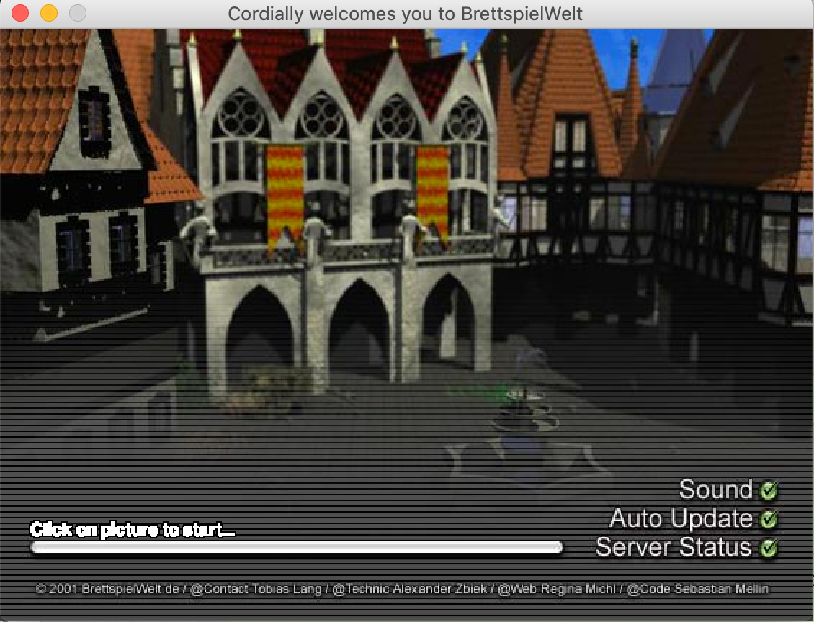
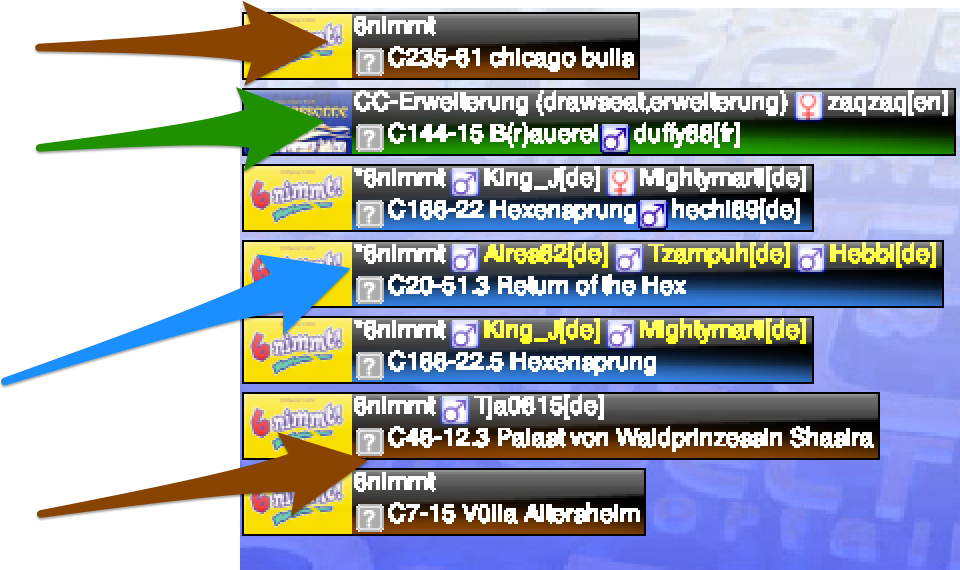
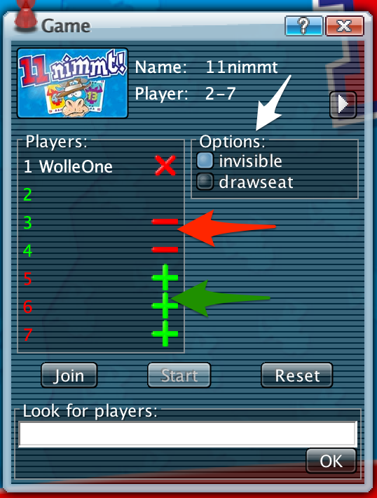

# Brettspielewelt

Brettspielewelt bietet die Möglichkeit die verschiedensten Spiele zusammen zu spielen.

## Angebotene Spiele

[Hier](https://www.brettspielwelt.de/Spiele/) ist eine Liste von Spielen auf BrettspielWelt.

## Userinterface

Wenn das Spiel installiert wurde, sollte der Startbildschirm so aussehen. Einfach auf das Bild klicken um zu starten.



Als nächstes landet man zunächst in der Lobby. 

* Oben ist die Taskleiste in dem alle Funktionen zum Steuern des Clients 
* Links sind die Spiele die ausgewählt werden können
* Rechts/Mittig werden alle Tische und Lobbys angezeigt. Die verschiedenen Farben zeigen an ob Tische bespielbar sind
* Unten ist der Chat wo die verschiednenen Channels angezeigt werden
* Unter dem Chat ist die Commandozeile. In diesem können wichtige Spielecommandos angebene werden. [Alle Befehle](https://www.brettspielwelt.de/Hilfe/Kommandos/)


## Spiel auswählen

### Tisch bekommen

Auf der linken Seite des Programms könnt ihr die verfügbaren Spiele sehen. Wenn dort das entsprechende Spiel ausgewählt wird, werden nur noch Tische für dieses Spiel angezeigt. Die Hintergrundfarben zeigen euch die verschiedenen Statis an:

 Das zeigt an das es freie Tische gibt.

 Das zeigt an das die Spiele schon laufen.

 Das zeigt an das hier noch Mitspieler gesucht werden


Hier könnt ihr ein Beispiel sehen, in dem alle verschiedenen Farben existieren.


### Tisch Einstellungen

Wenn der Spielleiter nun einen Tisch hat kann er mehrere Einstellungen treffen. 

In dem Kästchen *Players/Spieler* folgende Actionen:
* grüne +: Spielplatz hinzufügen. Solange der nicht offen ist, kann niemand joinen 
* rote -: Spielplatz löschen, damit kein nicht besetzter Spielplatz gebraucht wird.
* rote X: Spieler rauswerfen.

In dem Kästchen *Options/Einstellungen* gibt es mehr oder weniger Optionen abhängig vom gewählten Spiel. Wenn ihr das Spiel nur mit bekannten Leuten spielen wollt, solltet ihr das Kästchen *invisible* auswählen. Dann können Leute dem Spielleiter nur joinen, wenn sie ihn kennen.





### Spieleiter joinen

Nachdem ein Spielleiter nun einen Tisch hat, muss man zu diesem Tisch kommen. Dafür gibt es verschiedene Möglichkeiten:

1. Benutzen von Befehlen 
2. In der Lobby den Tisch des Spielers finden

Ich empfehle die erste Variante. Dafür benutzt ihr einfach die Befehle aus der Gruppe [Startbefehle](#Startbefehle)

Der */hook* Befehl führt euch zu dem gewählten Spieler und der */join* Befehl lässt euch dem Spiel beitreten.

### Spiel starten

Um das Spiel zu starten müssen nun alle Spieler */start* in die Kommdandokonsole eingeben oder über das Fenster *Game* den *Start* Button klicken. 

Danach sollte das Spiel beginnen.

### Erklärung der Spielregeln

Wenn man das Spiel nicht kennt oder nicht mehr genau an die Spielregeln erinnert, kann oben unter Taskbar Help/Hilfe klicken und bekommt erstmal eine kurze Erklärung und kann sich auch noch eine längere Erklärung anzeigen lassen.


## Wichtige Befehle

Hier werden die wichtigsten Befehle gesammelt. Eine Übersicht über alle Befehle kann hier gefunden werden: [Alle Befehle](https://www.brettspielwelt.de/Hilfe/Kommandos/)

Alle Befehle werden in der Commandozeile eingeben. WICHTIG: Die Befehle fangen immer mit '/' an.

### Startbefehle

Dieser Befehl führt dazu, dass man zu einem bestimmten Spieler springen kann kann.

```
/hook <SPIELERNAME> 
```

Dieser Befehl fürht dazu das mit dem Spiel/Table von dem bestimmten Spieler beitritt.

```
/join
```

### Spielbefehle

Dieser Befehl führt dazu das der Spieler den Start des Spiels akzeptiert.

```
/start
```

Dieser Befehl führt dazu, dass man ein laufendes Spiel beenden kann. Dafür muss der Spielleiter (Spieler an der Stelle 1) diesen Befehl eingeben. Nachdem das getan wurde, müssen alle Spieler das mit dem zweiten Befehl akzeptieren (auch der Spielleiter).

```
/masterreset
```

```
/accept
```
