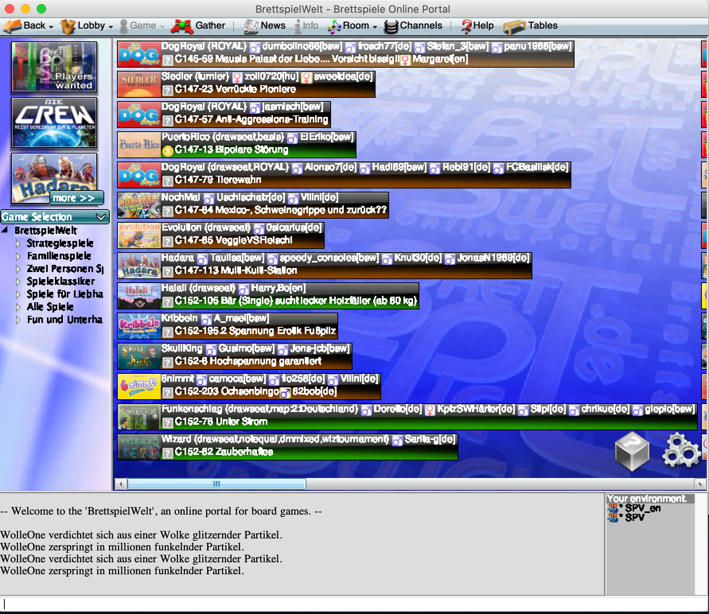

# Brettspielewelt

Brettspielewelt bietet die Möglichkeit die verschiedensten Spiele zusammen zu spielen.

## Angebotene Spiele

[Hier](https://www.brettspielwelt.de/Spiele/) ist eine Liste von Spielen auf BrettspielWelt.

## Userinterface

Wenn das Spiel installiert wurde, sollte der Startbildschirm so aussehen. Einfach auf das Bild klicken um zu starten.


Als nächstes landet man zunächst in der Lobby. 

* Oben ist die Taskleiste in dem alle Funktionen zum Steuern des Clients 
* Links sind die Spiele die ausgewählt werden können
* Rechts/Mittig werden alle Tische und Lobbys angezeigt. Die verschiedenen Farben zeigen an ob Tische bespielbar sind
* Unten ist der Chat wo die verschiednenen Channels angezeigt werden
* Unter dem Chat ist die Commandozeile. In diesem können wichtige Spielecommandos angebene werden. [Alle Befehle](https://www.brettspielwelt.de/Hilfe/Kommandos/)



## Wichtige Befehle

Hier werden die wichtigsten Befehle gesammelt. Eine Übersicht über alle Befehle kann hier gefunden werden: [Alle Befehle](https://www.brettspielwelt.de/Hilfe/Kommandos/)

Alle Befehle werden in der Commandozeile eingeben. WICHTIG: Die Befehle fangen immer mit '/' an.

### Startbefehle

Dieser Befehl führt dazu, dass man zu einem bestimmten Spieler springen kann kann.

```
/hook <SPIELERNAME> 
```

Dieser Befehl fürht dazu das mit dem Spiel/Table von dem bestimmten Spieler beitritt.

```
/join
```

### Spielbefehle

Dieser Befehl führt dazu, dass man ein laufendes Spiel beenden kann. Dafür muss der Spielleiter (Spieler an der Stelle 1) diesen Befehl eingeben. Nachdem das getan wurde, müssen alle Spieler das mit dem zweiten Befehl akzeptieren (auch der Spielleiter).

```
/masterreset
```

```
/accept
```
